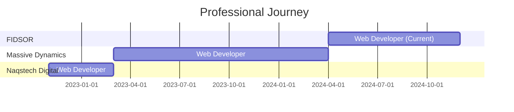

# Hi there, I'm Ahmad Jawad 👋

<div align="center">
  
[](https://git.io/typing-svg)

</div>

## 🚀 About Me

Passionate **Full-Stack Developer** with **3+ years** of experience building dynamic, high-performance web applications. I specialize in creating scalable solutions using modern frameworks and technologies, with a strong focus on clean, maintainable code and exceptional user experiences.

- 🔭 Currently working at **FIDSOR, Islamabad**
- 🌱 Continuously learning and exploring new technologies
- 💼 Expertise in **RESTful API integration**, **database design**, and **responsive UI/UX**
- 📫 Reach me: **ahmadchohan31@gmail.com**
- 📱 Phone: **+923075646406**
- 🌍 Location: **Pakistan**

---

## 💻 Tech Stack

### Languages


### Frameworks & Libraries


### Database & Tools


---

## 🎯 Professional Key Skills

<table width="100%">
<tr>
<td width="50%" valign="top">

### 💡 Technical Expertise

**Programming Languages:**
- 🔹 PHP (Expert)
- 🔹 JavaScript (Advanced)
- 🔹 Python (Intermediate)
- 🔹 C++ (Intermediate)

**Frontend Development:**
- 🔹 HTML5, CSS3
- 🔹 Angular (Advanced)
- 🔹 Bootstrap (Expert)
- 🔹 Responsive UI/UX Design

**Backend Development:**
- 🔹 Laravel (Expert)
- 🔹 CodeIgniter (Expert)
- 🔹 RESTful API Integration

**Database Management:**
- 🔹 MySQL (Advanced)

</td>
<td width="50%" valign="top">

### 🛠️ Core Competencies

**CMS Development:**
- 🔹 WordPress (Expert)
  - Theme Customization
  - Plugin Development
  - SEO Optimization

**Development Tools:**
- 🔹 Docker
- 🔹 GitHub/Git Version Control
- 🔹 Visual Studio Code
- 🔹 Microsoft Office Suite

**Soft Skills:**
- 🔹 Communication & Teamwork
- 🔹 Time Management
- 🔹 Problem Solving
- 🔹 Analytical Thinking
- 🔹 Adaptability

</td>
</tr>
</table>

---

## 📊 Skills Proficiency

<div align="center">

### Backend Development


### Frontend Development


### CMS & Tools


</div>

---

## 📈 Experience Distribution

```text
Backend Development    ████████████████████░░  85%
Frontend Development   █████████████████░░░░░  75%
Database Design        ████████████████░░░░░░  70%
API Integration        ████████████████████░░  85%
WordPress Development  ██████████████████░░░░  80%
UI/UX Implementation   ███████████████░░░░░░░  65%
```

---

## 💼 Professional Experience Timeline



---

## 🏢 Work Experience

### 💼 Web Developer @ FIDSOR, Islamabad
**Apr 2024 - Present**
- ✅ Developed custom backend systems using **CodeIgniter** and dynamic, responsive frontends with **Angular**
- ✅ Ensured seamless integration between client-side and server-side functionality
- ✅ Customized and extended **WordPress** themes and plugins for growing business needs
- ✅ Implemented multiple platforms and technologies demonstrating versatility and adaptability

### 💼 Web Developer @ Massive Dynamics, Islamabad
**Mar 2023 - Apr 2024**
- ✅ Designed and developed **front-end website architecture** with intuitive UIs
- ✅ Built and customized **WordPress websites** with SEO-friendly solutions
- ✅ Created professional **user design** experiences for growing online communities
- ✅ Developed and managed robust backend systems with enhanced security

### 💼 Web Developer @ Naqstech Digital, Lahore
**Nov 2022 - Mar 2023**
- ✅ Developed scalable, high-performance front-end architecture
- ✅ Enhanced digital experiences with planned user interactions
- ✅ Built and maintained backend web applications ensuring seamless server-side operations
- ✅ Developed and managed server and database infrastructure

---

## 🌟 Featured Projects Portfolio

<div align="center">

| # | Project | Type | Technologies | Status | Link |
|---|---------|------|--------------|--------|------|
| 1 | **KAPL.org.sa** | Enterprise Platform | Laravel, Angular, MySQL | 🟢 Live | [Visit](https://kapl.org.sa/) |
| 2 | **QHMC Pro** | Healthcare Management | PHP, CodeIgniter, Bootstrap | 🟢 Live | [Visit](https://qhmcpro.com) |
| 3 | **Ride-Go.net** | Ride Sharing Platform | Laravel, Angular, MySQL | 🟢 Live | [Visit](https://ride-go.net) |
| 4 | **Top Solution Experts** | Corporate Website | WordPress, PHP | 🟢 Live | [Visit](https://topsolutionexperts.com) |
| 5 | **My Hair Force** | E-commerce Platform | WordPress, WooCommerce | 🟢 Live | [Visit](https://myhairforce.com) |
| 6 | **Heartfelt Scrubs AZ** | Medical Apparel Shop | WordPress, PHP, CSS | 🟢 Live | [Visit](https://heartfeltscrubsaz.com) |
| 7 | **Austin Guard Patrol** | Security Services | PHP, Bootstrap, MySQL | 🟢 Live | [Visit](https://austinguardpatrol.com) |

</div>

## 🏆 Key Achievements

<table>
<tr>
<td width="33%">
<div align="center">

<h3>7+</h3>
<p>Live Projects</p>
</div>
</td>
<td width="33%">
<div align="center">

<h3>3+</h3>
<p>Years Experience</p>
</div>
</td>
<td width="33%">
<div align="center">

<h3>3</h3>
<p>Certifications</p>
</div>
</td>
</tr>
</table>

---

## 🎓 Education & Certifications

### 🎓 Education
**Bachelor of Science in Software Engineering**  
*University of Engineering & Technology (UET) Taxila, Islamabad*  
📅 Sep 2017 - Sep 2021  
🎯 **Specialization:** Computer Engineering  
📚 **Major Subjects:** Database Management, Network Security, Microprocessor, OOP & Data Structures (C++)  
🔬 **Final Year Project:** IMU Based Namaz Khushoo Tracker

### 📜 Professional Certifications
- ✅ **Data Visualization with Power BI** - Advanced analytics and reporting
- ✅ **Data Visualization in Tableau** - Interactive dashboard creation
- ✅ **Python for Data Science** - Data analysis and machine learning fundamentals

## 🤝 Let's Connect

<div align="center">

[](https://www.linkedin.com/in/ahmad-jawad)
[](mailto:ahmadchohan31@gmail.com)
[](tel:+923075646406)
[](https://github.com/ahmadjawad)

</div>

---

<div align="center">

### 💡 *"Dedicated to continuous learning, innovation, and delivering scalable solutions that drive business growth and enhance user experience."*


---

⭐️ **Open for Collaboration** | 🚀 **Available for Freelance Projects** | 💼 **Always Learning**

---

**© 2024 Ahmad Jawad** | Made with ❤️ and ☕

</div>
